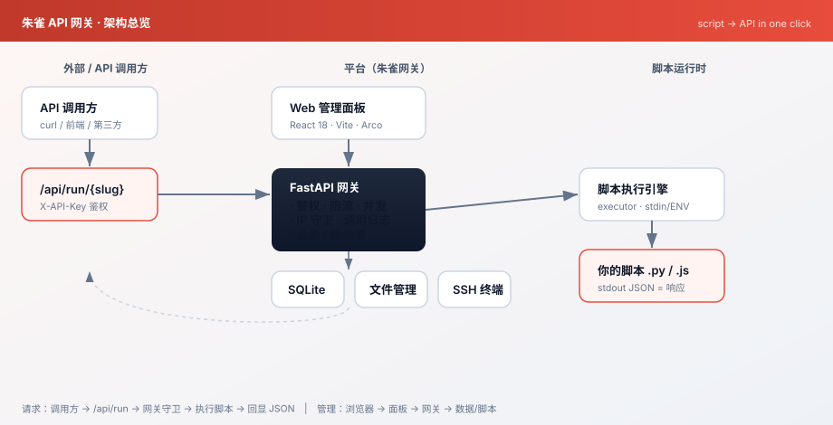
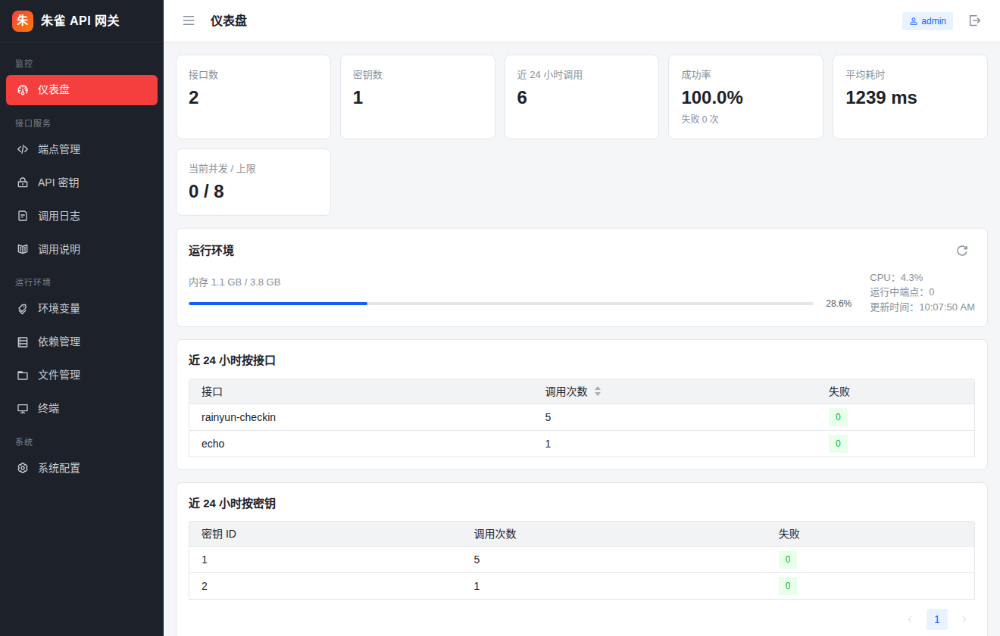
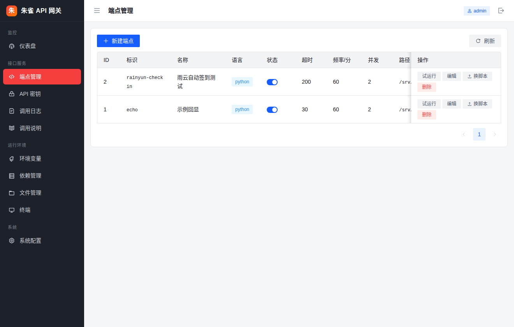
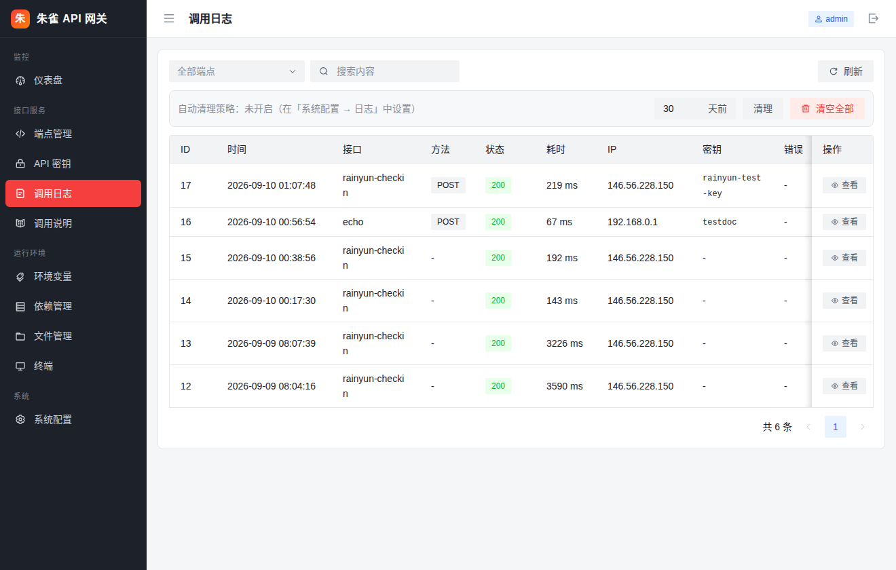
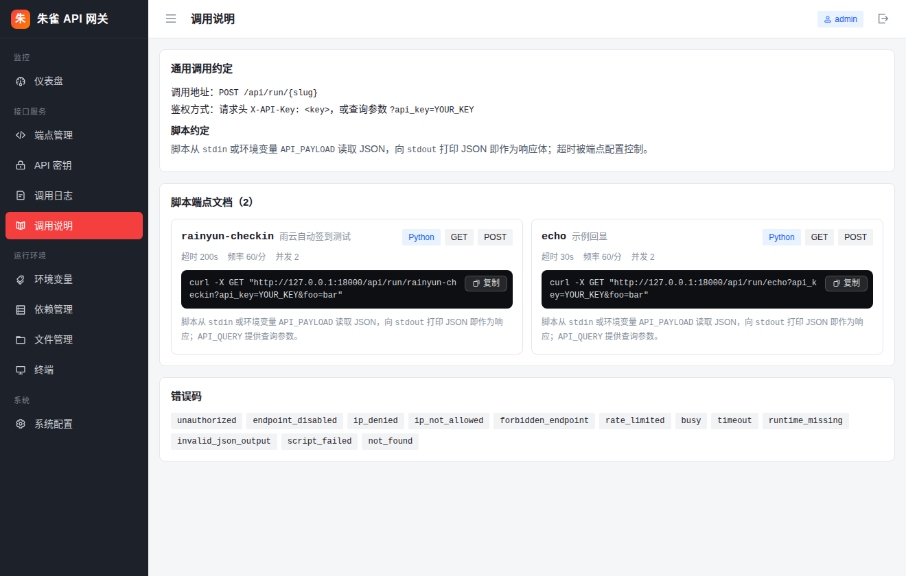
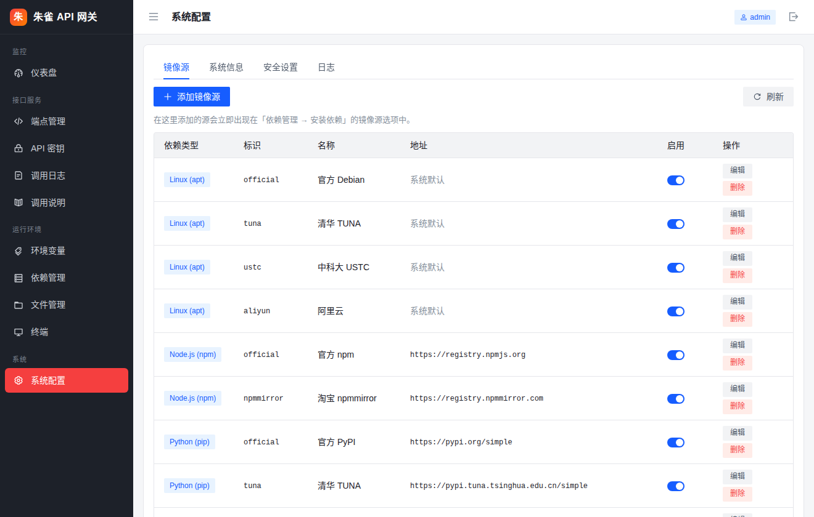

# 朱雀 API 网关 · ZhuQue API Gateway

> 本是想弄个「朱雀定时面板 + API 网关」的轻量自托管工具：把一段 Python / Node.js 脚本，包装成一个带鉴权、限流、日志、速率控制的 HTTP 接口，并通过 Web 面板统一管理。

`朱雀 API 网关` 让你把任意脚本 instantly 变成一个可远程调用的 API 端点：上传/指定一个脚本，分配一个密钥，外部就能通过 `POST /api/run/{slug}` 触发它，脚本从标准输入 / 环境变量读取 JSON，向标准输出打印 JSON 即作为响应。内置 Web 管理面板提供端点管理、密钥管理、调用日志、环境变量、系统配置、依赖管理、文件管理与一个可直接在浏览器里用的 SSH 终端。



---

## 功能特性

- **脚本即 API**：支持 `.py`（Python）与 `.js`（Node.js）脚本；脚本从 `stdin` 或环境变量 `API_PAYLOAD` 读入 JSON，向 `stdout` 打印 JSON 即作为响应体，`API_QUERY` 提供查询参数。
- **端点管理**：增删改查脚本端点，支持启用/暂停、超时（1–300s）、每分钟频率、并发上限、允许/拒绝的 IP、允许的 HTTP 方法（GET/POST/PUT/PATCH/DELETE）。
- **密钥管理**：为每个密钥独立设置频率限制、可访问的端点白名单、IP 白名单；密钥仅展示前缀，哈希存储。
- **调用日志**：完整记录每次调用的请求方法、请求体、响应体、状态码、耗时、调用方 IP、所用密钥名；支持按端点筛选与查看详情，并支持手动清理 / 自动过期清理。
- **环境变量**：面板内管理环境变量（变量名/值/备注/启用状态），支持按变量名、值、备注模糊搜索。
- **系统配置**：镜像源 CRUD（pip / npm / apt）、系统信息（CPU/内存/磁盘/运行时版本）、安全设置（修改密码需先验证旧密码）。
- **依赖管理**：pip / npm / apt 三选项卡，展示已装依赖，内置镜像源选择，支持在线安装并实时查看日志。
- **文件管理**：内置 Web 文件管理器（列目录、读/写、上传、新建、删除），限定在 `DATA_DIR` 数据目录内。
- **SSH 终端**：面板内嵌 Web 终端（xterm.js + WebSocket），可在浏览器里直接登录容器 Shell（已适配移动端软键盘输入）。
- **Web 面板**：React 18 + Vite 5 + Arco Design 2.x，前端构建产物由镜像多阶段构建自动生成。

---

## 界面预览

> 以下截图来自部署在 `120.220.76.140:10396` 的真实面板（已脱敏）。

| 仪表盘 | 端点管理 |
| --- | --- |
|  |  |

| 调用日志（可查看详情） | 脚本 API 文档 |
| --- | --- |
|  |  |

| 系统配置 | |
| --- | --- |
|  | |

---

## 技术栈

| 层 | 选型 |
| --- | --- |
| 后端 | Python 3.11 · FastAPI · Uvicorn · SQLite（WAL） |
| 前端 | React 18 · Vite 5 · TypeScript · Arco Design 2.x |
| 终端 | xterm.js + WebSocket（pty） |
| 部署 | Docker（多阶段构建）· docker compose |
| 鉴权 | 管理面板基于 HMAC 签名 Session Cookie；API 调用基于 `X-API-Key` / `?api_key=` |

---

## 目录结构

```
ZhuQue_Api_Gateway/
├── backend/                  # 后端（FastAPI）
│   ├── app/
│   │   ├── main.py          # 应用入口、路由挂载、静态资源、启动预热
│   │   ├── routers/         # 各业务路由（admin/run/fs/pkg/env/sys/term）
│   │   ├── db.py            # SQLite 初始化与数据迁移
│   │   ├── auth.py          # 管理员/密钥鉴权
│   │   ├── executor.py      # 脚本执行引擎
│   │   ├── schema.py        # 入参校验与公共模型
│   │   ├── config.py        # 配置与默认值
│   │   ├── util.py          # 通用工具（日志、响应封套）
│   │   └── guards.py        # 限流/并发/IP 守卫
│   ├── examples/
│   │   ├── echo.py          # 示例端点：原样回显 payload 与 query
│   │   └── echo.js          # 同名 Node.js 示例
│   ├── docker/entrypoint.sh  # 容器入口：生成 SSH 主机密钥、起 sshd、起 Uvicorn
│   └── requirements.txt
├── frontend/                # 前端（React + Vite）
│   ├── src/                 # 页面与组件
│   ├── index.html
│   ├── vite.config.js
│   └── package.json
├── Dockerfile               # 多阶段构建（前端构建 → 后端运行）
├── docker-compose.yml
├── .dockerignore
├── .env.example
├── .gitignore
├── README.md
├── API.md                   # 详细的后端 API 文档（逐端点）
└── deploy-smoke.py          # 部署冒烟脚本（参考）
```

---

## 快速开始（Docker）

> 需要本机已安装 Docker 与 docker compose（v2）。

```bash
# 1. 准备环境变量
cp .env.example .env
#   按需修改 .env：WEB_PORT / SSH_PORT / ADMIN_USER / ADMIN_PASSWORD / ROOT_PASSWORD

# 2. 构建并启动（多阶段构建会自动用 Node 构建前端，无需手动构建）
docker compose up -d --build

# 3. 访问
#   Web 面板： http://<宿主机IP>:<WEB_PORT>   （默认 8000）
#   SSH 终端： ssh -p <SSH_PORT> root@<宿主机IP>  （密码见 ROOT_PASSWORD）
```

首次启动会自动：
- 在 `./data/app.db` 初始化 SQLite 库与管理员账号（账号见 `.env` 的 `ADMIN_USER` / `ADMIN_PASSWORD`）；
- 写入内置镜像源（pip / npm / apt）；
- 注册示例端点 `echo`（`slug=echo`，对应 `backend/examples/echo.py`）。

### 仅构建镜像

```bash
docker build -t api-gateway:latest \
  --build-arg BASE_IMAGE=python:3.11-slim-bookworm .
```

> 若构建环境需要代理（如内网），可在 `docker build` 时传入 `--build-arg HTTPS_PROXY=...`，或在 Dockerfile 各 `RUN` 前加代理环境变量。

### 数据持久化

compose 将宿主 `./data` 挂载到容器 `/srv/gateway/data`，包含：
- `app.db`：主数据库（端点、密钥、日志、环境变量、镜像源、设置）；
- `scripts/`：各端点的脚本文件（按 `slug` 分目录）；
- `secret.txt`：Session 签名密钥（丢失会导致已登录会话失效）；
- `ssh_keys/`：容器 SSH 主机密钥。

---

## 本地开发（前后端分离）

### 后端

```bash
cd backend
python3 -m venv .venv && source .venv/bin/activate
pip install -r requirements.txt
# 需要 node/npm 用于依赖管理页；openssh 用于终端
uvicorn app.main:app --host 0.0.0.0 --port 8000
```

环境变量（均可选，默认值见 `backend/app/config.py`）：

| 变量 | 默认 | 说明 |
| --- | --- | --- |
| `ADMIN_USER` | `admin` | 首次创建的管理员用户名 |
| `ADMIN_PASSWORD` | `changeme` | 首次创建的管理员密码 |
| `DATA_DIR` | `<repo>/backend/data` | 数据根目录 |
| `DB_PATH` | `$DATA_DIR/app.db` | SQLite 文件路径 |
| `SCRIPTS_DIR` | `$DATA_DIR/scripts` | 脚本存放目录 |
| `SECRET_FILE` | `$DATA_DIR/secret.txt` | Session 签名密钥文件 |
| `PYTHON_BIN` / `NODE_BIN` | `python3` / `node` | 脚本运行解释器 |
| `HOST` / `PORT` | `0.0.0.0` / `8000` | 监听地址与端口 |

### 前端

```bash
cd frontend
pnpm install        # 或 npm install
pnpm dev            # 开发服务器，默认代理 /admin、/api 到 http://127.0.0.1:8899
pnpm build          # 产物输出到 frontend/dist
```

> 开发态代理目标 `8899` 仅用于本地；生产镜像由 Dockerfile 把 `frontend/dist` 拷到 `backend/web/dist` 并由 FastAPI 直接托管。

---

## 示例：把脚本变成 API

`backend/examples/echo.py`（也是容器内预置的 `echo` 端点）：

```python
import json
import os
import sys

raw = os.environ.get("API_PAYLOAD") or ""
if not raw:
    raw = sys.stdin.read() or "{}"
payload = json.loads(raw)
query = json.loads(os.environ.get("API_QUERY") or "{}")
print(json.dumps({"echo": payload, "query": query}, ensure_ascii=False))
```

调用它（假设面板地址 `http://host:8000`，密钥 `sk_xxx`）：

```bash
curl -X POST "http://host:8000/api/run/echo" \
  -H "X-API-Key: sk_xxx" \
  -H "Content-Type: application/json" \
  -d '{"name":"world"}'
```

响应：

```json
{
  "ok": true,
  "error": null,
  "data": {"echo": {"name": "world"}, "query": {}},
  "meta": {"slug": "echo", "duration_ms": 2, "request_id": "a1b2c3d4e5f6"}
}
```

> 传参也可走查询字符串：`?api_key=sk_xxx&foo=bar`（GET/POST 均可，取决于端点允许的 HTTP 方法）。

编写自己的脚本只要遵守一条约定：**从 `API_PAYLOAD`/`stdin` 读 JSON，向 `stdout` 打印一个 JSON 对象**。更多端点管理、鉴权、错误码与逐字段说明见 [`API.md`](./API.md)。

---

## 贡献者

- **kyu（hanx11192-ship-it）** — 项目发起、owner、提供屎山原型 😆
- **WorkBuddy** — 代码改造、性能优化与文档整理

---

## License

[MIT](./LICENSE) © 2026 kyu
